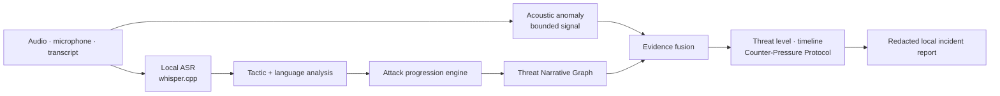

<h1 align="center">SCAMTRACE</h1>

<strong>Conversational Attack Firewall</strong>

Detect the manipulation. Explain the attack. Protect the decision.

  
  
  
  

  <a href="#demo-mode">Demo</a> · <a href="docs/ARCHITECTURE.md">Architecture</a> · <a href="docs/ML_HARDENING.md">ML hardening</a> · <a href="docs/PRIVACY.md">Privacy</a> · <a href="docs/DEMO_GUIDE.md">Demo guide</a>

SCAMTRACE is a privacy-preserving, real-time conversational security layer for CodeGyaan’26. It consumes a typed transcript, local ASR segment stream, or uploaded recording and identifies behavioral signs of social engineering: authority impersonation, threats, urgency, isolation, credential extraction, payment demands, and remote-access requests.

It does **not** make a legal accusation or treat an AI-generated voice as automatically malicious. Its core question is: *is this conversation behaving like a cyberattack?*

> **Threat decision-support, not caller accusation.** SCAMTRACE gives a person the evidence and a safe next action before they disclose an OTP, transfer money, or install remote access.

## Why this is different

| Typical scam detector | SCAMTRACE |
| --- | --- |
| Flags isolated keywords or guesses whether a voice is AI | Tracks the **behavioural progression** of a social-engineering attack |
| Gives an opaque risk label | Produces timestamped tactics, evidence provenance, attack-path alignment, and a counter-pressure action |
| Depends on a hosted model | Performs core analysis and ASR **locally**, with no runtime cloud API |
| Treats synthetic voice as the threat | Treats synthetic voice as a bounded, uncertain supporting signal—not a criminality verdict |

## Security signal flow

> **Live dashboard visuals:** the repository deliberately avoids embedding a
> low-resolution interface screenshot. Run `./run.sh` and open the local
> dashboard for the interactive transcript, evidence timeline, and safe-action
> experience. The project image will be replaced only with a verified,
> full-resolution capture of the redesigned live interface.

## What works

- Local incremental-analysis interface: start an ephemeral session and submit timestamped ASR segments as they arrive. Every segment receives a new threat score, evidence, timeline, and intervention status.
- A local dashboard exists only as a demonstration surface, with scenarios, transcript input, audio upload, microphone capture, live evidence, timeline, and JSON incident report export.
- Local whisper.cpp ASR adapter with timestamped segments. The installed multilingual Whisper base model supports English, Tamil, Hindi, and Hinglish-adjacent speech.
- Layered scam intelligence: auditable phrase/tactic detection with safety-advice polarity guards + a safe JSON language baseline trained from licensed public Hinglish call data + non-linear attack progression + evidence fusion.
- Threat Narrative Graph: timestamped tactic evidence is compared with bounded digital-arrest, bank takeover, courier/customs, family-emergency, and remote-device takeover playbooks. It reports behavioural alignment—not a probability or caller identity.
- Versioned case graph: every narrative exports a stable evidence → tactic → playbook schema with timestamps and provenance, without caller identity or raw transcript.
- Counter-Pressure Protocol: instead of only assigning a level, SCAMTRACE explains the irreversible action at risk, breaks isolation, gives a safe independent-verification route, and states what evidence would lower concern.
- Privacy-safe operations: incident reports redact likely credentials and identity values by default; explicit user feedback and drift review are aggregate-only, local-memory signals that cannot change a live alert or automatically retrain a model.
- STDM-1 state-decision model: a local calibrated-distribution prototype over NORMAL through FINANCIAL_EXTRACTION. It is deliberately in shadow mode until independently validated on consented real calls.
- Scam Momentum (0–100) and LOW / VERIFY / HIGH / CRITICAL levels. This is a threat indicator, **not a calibrated scam probability**.
- Actual local audio inspection using spectral/dynamic acoustic measurements. It is intentionally labelled an anomaly fallback, not a deepfake verdict.
- Evaluation, ablation report, performance benchmark, unit tests, structured local logs, and offline core operation after model setup.

## Architecture

    Audio / microphone / transcript stream
              |
              +-- local whisper.cpp ASR (audio)
              +-- acoustic anomaly signal (audio)
              v
    Incremental tactic detector + language baseline
              v
    Attack progression engine
              v
    Threat Narrative Graph (bounded attack-path alignment)
              v
    Explainable evidence fusion
              v
    Counter-Pressure Protocol: safe exit + counterfactual verification
              v
    Threat score, timeline, intervention, local report

## Quick start

The app uses only a local Python server plus browser assets. No cloud API is called at runtime.

    ./run.sh

Open [http://127.0.0.1:8765](http://127.0.0.1:8765).

For a clean machine, install Python 3.11+, NumPy, and optionally pytest:

    python3 -m venv .venv
    .venv/bin/python -m pip install -r requirements.txt
    brew install whisper-cpp
    ./scripts/setup_models.py --download
    ./run.sh

The 147 MB multilingual Whisper base model is downloaded once into models/. The server runs ASR with CPU mode for reliable local operation on the tested Apple Silicon environment. After that download, disconnecting Wi-Fi does not affect core analysis.

## Real-time security interface

The process-local REST interface is designed for a local ASR worker or an
on-device client. It holds no raw audio and expires sessions after 15 minutes
by default.

    POST /api/realtime/session
    POST /api/realtime/session/{session_id}/segment
    GET  /api/realtime/session/{session_id}
    POST /api/realtime/session/{session_id}/close

Submit a segment body such as:

    {"text":"Do not disconnect. Transfer money now.","start":8,"end":12,"language":"en"}

Run the live local proof:

    .venv/bin/python scripts/realtime_demo.py --scenario human_digital_arrest

See [the real-time integration guide](docs/REALTIME_API.md).

## Decision-model research track

STDM-1 turns accumulated local evidence into a bounded attack-state
distribution and an uncertainty value. The current model-development artifact
uses authored synthetic contrast data, so it is shadow-only and cannot alter
alerts. This is a deliberate safety gate, not a missing feature.

    .venv/bin/python scripts/generate_stdm_dataset.py
    .venv/bin/python scripts/train_stdm.py

See [STDM-1](docs/STDM_1.md) for measured development metrics, calibration
limits, and promotion criteria.

## Demo mode

Click any of the built-in scenarios:

1. Normal human call → LOW
2. AI voice — safe → voice fixture anomaly only, LOW
3. Human scam — digital arrest → CRITICAL
4. AI scam — bank / OTP → CRITICAL
5. Tamil scam → CRITICAL
6. Hinglish scam → CRITICAL
7. Adversarial scam → HIGH or CRITICAL

Scenario voice provenance is visibly labelled as a demo fixture. It never substitutes for live voice inference on custom audio. See [the demo guide](docs/DEMO_GUIDE.md).

## Verify the build

    .venv/bin/python scripts/train_scam_classifier.py
    .venv/bin/python -m pytest
    .venv/bin/python scripts/evaluate.py
    .venv/bin/python scripts/evaluate_decision_contracts.py
    .venv/bin/python scripts/evaluate_adversarial.py
    .venv/bin/python scripts/benchmark.py
    .venv/bin/python scripts/run_demo.py

Artifacts are written to reports/evaluation.json, reports/evaluation.md, reports/performance.json, and reports/performance.md.

Training uses the Apache-2.0 [Indian Cyber Scam PhoneCall Hinglish Dataset](https://huggingface.co/datasets/ysangam/Indian_Cyber_Scam_PhoneCall_Hinglish_Dataset), restricted to text and label columns. The current data audit found that 10,000 source rows collapse to 783 unique transcripts, so SCAMTRACE splits by normalized template family—not raw row—before generating 70 ASR-spelling variants from training data only. The selected class-balanced sparse logistic baseline recorded 98.71% accuracy, 97.25% macro F1, 99.26% balanced accuracy, 0.00% FPR, 1.48% FNR, 0.0074 balanced Brier, and 0.0143 ECE on a 155-record template-family holdout. It was selected over Naive Bayes for better score quality, not inflated accuracy. This is template-corpus performance, not real-world call accuracy. The separate 20-case curated multilingual regression suite currently passes 20/20, while the post-improvement 22-case authored adversarial decision gate reports TP 14, TN 8, FP 0, FN 0; neither is independent evaluation. Latest text analysis averaged 1.319 ms with 32.91 MB peak RSS. A prior local Whisper run averaged 1.08 s on a 10.5-second official Whisper sample.

## Privacy

- Audio processing: local, temporary directory only
- Speech recognition: local whisper.cpp model
- AI inference: local
- Cloud API calls: none
- Raw audio retention: off
- Transcript persistence: off unless the user explicitly downloads a report; exported values are redacted by default

See [Privacy](docs/PRIVACY.md) and [Threat Model](docs/THREAT_MODEL.md).

## Honest limitations

The production path currently uses a transparent acoustic anomaly fallback, not a calibrated RawTFNet/ASV anti-spoofing checkpoint. It therefore returns uncertain rather than claiming that a live caller is synthetic. The Threat Narrative Graph uses bounded, auditable playbooks; it can miss unfamiliar narratives, ASR errors, speakers, or dialects and therefore never asserts criminality. Phrase coverage is strongest for the included English, Tamil, Hindi, and Hinglish scenarios and needs field validation before deployment. This is decision support, not a reporting, law-enforcement, or call-interception product.

See [Data governance](docs/DATA_GOVERNANCE.md), [Limitations](docs/LIMITATIONS.md), [Model Card](docs/MODEL_CARD.md), [architecture hardening review](docs/hardening/hardening.md), and [publication-readiness gate](docs/PUBLICATION_READINESS.md).

## License

MIT. Whisper.cpp and model weights are subject to their respective upstream terms.
