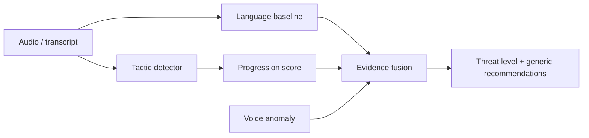
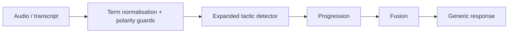
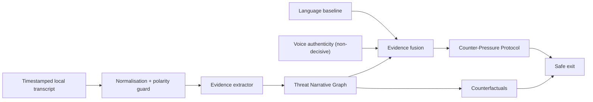
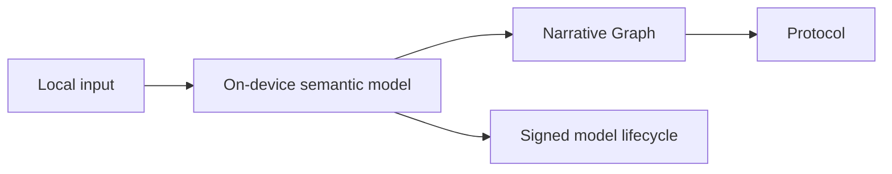

# Security Hardening Proposal: Evidence ledger and counter-pressure intervention

## Decision

We are deciding between **Option 1, stronger local guards**; **Option 2, a
Threat Narrative Graph and Counter-Pressure Protocol**; and **Option 3, an
on-device semantic foundation model**. The structured comparison is in
[hardening.json](../hardening.json).

## Executive Recommendation

I recommend **Option 2**. It turns timestamped tactic evidence into a bounded
attack narrative and turns a risk result into a safe interruption. Option 1
ships with it because normalisation and negation handling are needed regardless.
Option 3 should remain a shadow-mode research route until we can independently
test it on target languages and target hardware.

## Evidence

I inspected the current code and documents. E01 — *Current decision ownership*
shows that tactics, progression and fusion are returned independently. E02 —
*Lexical boundary* shows that explainable matching lacks an explicit polarity
guard. E03 — *Realtime boundary* shows that sessions are local and bounded but
not governed by a distinct intervention state. E04 — *Evaluation limits*
prevents a field-accuracy claim. E05 — *Incumbent Android detection* means a
generic local detector is not sufficient differentiation. E06 — *Voice
generalisation benchmark* means a non-validated acoustic signal must stay
non-decisive. The full evidence map is in [context.md](../context.md).

## Current Design And Failure Mode

The current path is a sound prototype: local ASR/text feeds direct tactics, a
small language baseline, progression, and capped fusion. It fails safely when
voice analysis is unavailable and does not persist raw audio. The structural gap
is that no component owns the relationship between ordered evidence and the
safest way to interrupt the active coercion. A score can be transparent without
being sufficiently actionable or differentiated.

## Desired Invariants

- Every high-risk result names the unsafe action and its timestamped evidence.
- A high-severity intervention needs a direct extraction/control request, a
  coherent bounded attack path, or both—not a voice label alone.
- Each result gives a threat-family-specific safe exit and independent
  verification route.
- Each result names a counterfactual fact that could lower concern.
- The graph stays bounded by current session limits and adds no raw-audio or
  transcript persistence.

## Constraints And Non-Goals

This does not provide phone-call interception, caller identity verification,
automated reporting, a legal conclusion, speaker diarisation, or a validated
deepfake model. It also does not turn demo chains into a field benchmark.

## Before Architecture

The current design fuses independent signals, but does not own chain coherence
or safe disruption.

| Change | Before | After with Option 2 | Security consequence | Cost |
| --- | --- | --- | --- | --- |
| Decision owner | Score implies chain | Narrative graph owns events and playbook alignment | Fewer invisible score-policy changes | More taxonomy governance |
| Intervention | Generic advice | Safe exit plus counterfactual | Breaks isolation without engaging caller | Small bounded local computation |
| Voice use | Capped contribution | Same cap, explicit non-decisive provenance | Prevents deepfake-only escalation | No new deepfake metric |

## Options

### Option 1: Strengthen local guards

We retain the current boundaries and add robust ASR term normalisation, phrase
coverage and negation guards. This is fast, local and easy to roll back. It
improves both obvious ASR variants and safety-advice false positives. It does
not solve the ownership gap, so it is tactical work that should accompany—not
replace—Option 2.

### Option 2: Threat Narrative Graph and Counter-Pressure Protocol

We add one deterministic decision owner between evidence extraction and the user
response. It creates compact event nodes from tactic, timestamp, segment and
phrase evidence; evaluates a small bounded set of named playbooks; and reports
*alignment*, not criminality or probability. The protocol then selects a safe
exit: stop the interaction, break isolation, verify through an independently
found official channel, and contain money or device access where appropriate.

The attractive part is that SCAMTRACE becomes a conversational safety system
rather than a label generator. We can demonstrate the call becoming a coercion
chain and show which independently verifiable fact would reduce concern. The
cost is maintaining playbooks and tests. The graph is bounded by the existing
session limit, and the deterministic response remains available if the language
or voice component is unavailable. Rollback disables additive fields and retains
the current fusion response.

### Option 3: On-device semantic foundation model

An on-device semantic model could help with novel paraphrase and code-switching.
That is attractive research, but it adds model supply-chain, hardware, latency,
abstention and version-governance obligations. It cannot replace the narrative
or intervention policy. We should only introduce it through shadow mode after
we have independent multilingual evaluation and a signed model lifecycle.

## Comparison

| Dimension | Option 1 | Option 2 | Option 3 |
| --- | --- | --- | --- |
| Security | Improves local lexical resilience | Explicit evidence-to-action boundary | Unknown until robust evaluation |
| Latency / memory | Near-neutral | Bounded by current segment limits | Likely materially higher |
| Reliability | Current deterministic path | Deterministic fallback remains | Requires model failure and abstention design |
| Operability | Low | Playbook governance, strong auditability | High model lifecycle burden |
| Migration | Easy | Additive response schema | New runtime and shadow rollout |

## Recommendation

I recommend Option 2 and its Option 1 safeguards. It is the credible way to
make SCAMTRACE more defensible now without pretending an unvalidated large model
would make it industry-grade by itself. Option 3 wins only when independent
evaluation, a device budget and safe deployment governance are funded.

## Evidence Coverage And Residual Risk

| Evidence | Effect | Residual risk |
| --- | --- | --- |
| E01 — Current decision ownership | Addresses | Novel chains can remain unrecognised. |
| E02 — Lexical boundary | Addresses | ASR and paraphrase can still hide evidence. |
| E03 — Realtime boundary | Mitigates | Browser recording is not telephony integration. |
| E04 — Evaluation limits | Unaffected | Independent field evaluation is mandatory. |
| E05 — Incumbent Android detection | Mitigates product sameness | Competitors can implement explanations. |
| E06 — Voice generalisation benchmark | Unaffected; cap retained | Validated anti-spoofing remains separate work. |

## Migration And Rollout

We add narrative and intervention fields without replacing ASR, the classifier
or fusion. In a future deployment, an `ENABLE_NARRATIVE_PROTOCOL` flag can
retain an immediate rollback. The local demo runs deterministic scenarios,
educational mention cases, adversarial phrases and incremental sessions before
we make any performance statement.

## Validation Plan

- Unit-test every playbook, event ledger, counterfactual and safe-exit route.
- Keep synthetic safe speech low risk.
- Test digital-arrest, bank/OTP, remote-access, courier and family-emergency
  chains.
- Test “never share OTP” and independent-verification advice do not become
  credential requests.
- Run full pytest, regression evaluation and benchmarks.
- Gate publication or field-performance claims on an independent consented
  multilingual real-call evaluation.

## Implementation Work Packages

1. Add polarity-aware tactic extraction.
2. Add bounded narrative graph and playbook alignment.
3. Add counter-pressure protocol and API/UI/report fields.
4. Add adversarial decision-contract tests and measured latency reports.

## Open Questions

- How can Android legally and reliably expose live call audio with consent?
- Which consented, de-identified Indian-language corpus can support independent
  evaluation?
- Which anti-spoofing checkpoint meets licence and local-latency requirements?
